<!-- Fun animated intro -->
<p align="center">
  
</p>

---

<!-- Fun intro with emojis -->
<div align="center">
  
  🎓 **3rd year software engineering student** by day<br>
  👨‍💻 **Full-stack tinkerer** by night<br>
  🚀 **Future AI/cyber/robotics explorer** by... well, someday!<br><br>
  
  ⚡ **Current status:** 
  ```javascript
  while(alive) {
    code();
    debug();
    coffee();
    repeat();
  }
  ```
  
</div>

---

## 🎨 My Toolbox of Fun

### 🌈 Frontend Stuff I Play With
<p align="center">
  
  
  
  
</p>

### 🦄 Backend Magic
<p align="center">
  
  
  
  
</p>

### 🗄️ Database Adventures
<p align="center">
  
  
  
  
</p>

---

## 🎯 What I'm Building RN

### 📚 **CozyReads Bookstore** 🌟
> My baby project that actually works (most of the time!)
```yaml
Status: "It compiles! 🎉"
Bugs: "Only 42 known ones 🐛"
Coffee consumed: "∞ cups ☕️"
Fun level: "100/10 😎"
```

### 🚧 **Other Experiments**
```bash
# My project queue:
$ npm start new-project
✅ Bookstore app - LIVE! 📚
⏳ Discord bot that tells jokes - 80%
⏳ Weather app that complains about rain - 60%
⏳ To-do app that judges you - 10%
🔮 AI that writes my assignments - dreamland
```

---

## 🎮 GitHub Game Stats

<div align="center">
  
  
  
  
  
</div>

---

## 📈 My Coding Journey (The Fun Version)

```mermaid
graph LR
    A[🤔 Watched a<br>YouTube tutorial] --> B[💥 'Hello World'<br>worked!] 
    B --> C[😱 Everything<br>broke] 
    C --> D[😭 Cried a bit] 
    D --> E[☕️ Drank coffee] 
    E --> F[🔧 Fixed one bug] 
    F --> G[😄 Created 10 new bugs] 
    G --> H[🔄 Repeat forever]
```



---

## 🎵 Currently Jamming To

```javascript
const codingVibes = {
  music: "Lofi beats to code/relax to",
  snack: "Coffee and questionable life choices",
  mood: "Debugging my way to enlightenment",
  energy: "Maintained by caffeine and hope",
  progress: "// TODO: Everything"
};
```

---

## 🤔 Things I Want to Explore (When I'm Bored)

<div align="center">
  
  | 🧠 AI Stuff | 🔐 Cyber Things | 🤖 Robot Friends |
  |------------|----------------|-----------------|
  | 🤖 Making robots smart | 🔓 Breaking stuff (ethically!) | ⚙️ Building robot pals |
  | 🎨 AI that draws cats | 🛡️ Protecting the internet | 🦾 Making things move |
  | 📝 Writing with AI | 🔍 Finding digital treasure | 🎮 Robot video games |
  
</div>

---

## 🐍 My Contribution Snake

<p align="center">
  <picture>
    <source media="(prefers-color-scheme: dark)" srcset="https://raw.githubusercontent.com/hellyrj/hellyrj/output/github-contribution-grid-snake-dark.svg">
    <source media="(prefers-color-scheme: light)" srcset="https://raw.githubusercontent.com/hellyrj/hellyrj/output/github-contribution-grid-snake.svg">
    
  </picture>
</p>

---

## 💭 My Dev Philosophy

> ### "Code should work. Comments are optional. Fun is mandatory." 🎉

<div align="center">
  
  ```python
  def my_coding_style():
      try:
          make_it_work()
      except:
          google_the_error()
          stackoverflow_it()
          if still_broken:
              cry_a_little()
              drink_coffee()
          else:
              celebrate()  # 🎉
  ```
  
</div>

---

## 🎪 Fun GitHub Trophies

<p align="center">
  
</p>

---

## 🌟 Current Mood

<p align="center">
  
  <br>
  <small><i>Yes, that's a real API. Yes, it's awesome.</i></small>
</p>

---

## 🎲 Let's Connect & Be Internet Friends!

<p align="center">
  <a href="#">
    
  </a>
  <a href="#">
    
  </a>
  <a href="mailto:your.email@example.com">
    
  </a>
  <a href="https://github.com/hellyrj">
    
  </a>
</p>

---

## 🎯 Today's Goals

```diff
+ [x] Wake up (mostly)
+ [x] Drink coffee
+ [x] Open VS Code
- [ ] Actually write code
+ [x] Check GitHub notifications
- [ ] Be productive
+ [x] Exist
```

---

<div align="center">
  
  ## 🎊 Thanks for stopping by!
  
  <p>
    <i>You're visitor number:</i><br>
    
  </p>
  
  <p>
    <sub><i>Made with ❤️ and too much coffee</i></sub>
  </p>
  
  
  
</div>
```

## 🎨 **Extra Fun Elements You Can Add:**

### **1. Add a random joke:**
```markdown
<!-- Random Dev Joke -->
<p align="center">
  
</p>
```

### **2. Spotify currently playing:**
```markdown
<!-- Spotify Playing -->
[](https://open.spotify.com/user/your-id)
```

### **3. Game-style progress bars:**
```markdown
### 🎮 Skill Levels (Like a Video Game!)

**JavaScript:** ⭐⭐⭐⭐⭐☆☆ (Level 5/10)
**CSS Magic:** ⭐⭐⭐⭐☆☆☆☆ (Level 4/10)  
**Debugging:** ⭐⭐⭐⭐⭐⭐⭐⭐ (Level 8/10) 🎮
**Coffee Drinking:** ⭐⭐⭐⭐⭐⭐⭐⭐⭐⭐ (MAX LEVEL) ☕️
```

### **4. Fun ASCII Art:**
```markdown
<!-- Terminal-style ASCII -->
```bash
         _nnnn_
        dGGGGMMb
       @p~qp~~qMb
       M|@||@) M|
       @,----.JM|
      JS^\__/  qKL
     dZP        qKRb
    dZP          qKKb
   fZP            SMMb
   HZM            MMMM
   FqM            MMMM
 __| ".        |\dS"qML
 |    `.       | `' \Zq
_)      \.___.,|     .'
\____   )MMMMMP|   .'
     `-'       `--'
```
```

## 🚀 **To Make It Even More You:**

1. **Add your actual inside jokes** about coding
2. **Include memes** you find funny
3. **Add GIFs** that match your personality
4. **Create fun badges** for things you're known for
5. **Add a "secret" section** with Easter eggs

This version shows:
- ✅ Your personality
- ✅ Your skills (but in a fun way)
- ✅ Your projects
- ✅ Your future interests
- ✅ That you don't take yourself too seriously
- ✅ That you're approachable and fun to work with

Perfect for making connections with other students and junior devs who appreciate humor! 🎉
